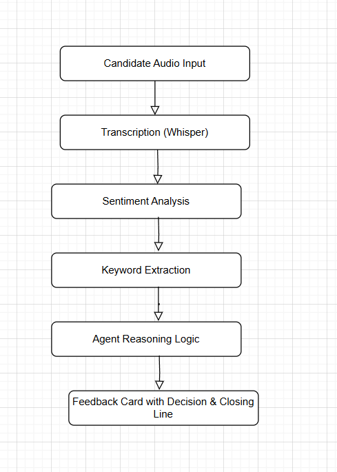

# Cog-Culture-Internship

# 🎤 Voice AI Agent for Telephonic Candidate Screening

## 💡 Use Case
This project implements an automated AI agent that can screen job candidates through telephonic audio responses. The agent transcribes their answers, analyzes sentiment, extracts important keywords (skills, location, experience), and makes intelligent screening decisions.

---

## ⚙️ Tech Stack
- **Python**
- **OpenAI Whisper** — Speech-to-text transcription
- **Hugging Face Transformers** — Sentiment analysis
- **Gradio** — Frontend demo interface

---

## 🗺️ Agent Flow Diagram


---

## 🚀 How to Run

```bash
pip install -r requirements.txt
python app.py
